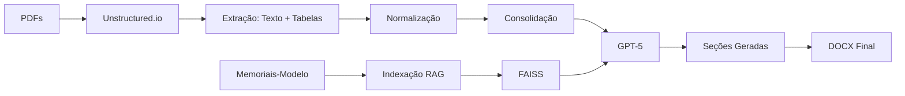

# 📄 Memorial Maker

**Geração automática de Memorial Descritivo de Telecomunicações com IA**

Ferramenta que extrai dados de plantas técnicas (PDFs) e gera memoriais descritivos profissionais usando **Unstructured.io** para extração e **GPT-5** para redação.

---

## 🌟 Características

- ✅ **Extração inteligente**: Usa [Unstructured.io](https://unstructured.io) para extrair texto e tabelas de PDFs
- ✅ **GPT-5**: Redação técnica de alta qualidade
- ✅ **RAG**: Indexa memoriais-modelo para manter estilo/estrutura
- ✅ **Interface dupla**: CLI e Web (Streamlit)
- ✅ **Normalização automática**: Padroniza nomenclatura de itens
- ✅ **Exportação**: DOCX formatado + CSVs de dados

---

## 📦 Tecnologias

| Categoria | Tecnologia |
|-----------|------------|
| **Extração de PDFs** | Unstructured.io |
| **LLM** | OpenAI GPT-5 |
| **RAG** | LangChain + FAISS |
| **Embeddings** | text-embedding-3-small |
| **Interface** | Streamlit + Typer |
| **Formato saída** | python-docx |

---

## 🚀 Instalação Rápida

### Requisitos
- Python 3.10+
- Tesseract OCR
- Poppler (pdf2image)
- LibreOffice (opcional, para converter .doc)

### Fedora/RHEL:
```bash
sudo dnf install python3 tesseract tesseract-langpack-por poppler-utils libreoffice-core
```

### Ubuntu/Debian:
```bash
sudo apt install python3 python3-venv tesseract-ocr tesseract-ocr-por poppler-utils libreoffice-writer
```

### Instalação:
```bash
# Clone o repositório
git clone <repo-url>
cd Memorial-descritivo

# Execute o script de setup
bash setup.sh

# Ou manualmente:
python3 -m venv venv
source venv/bin/activate
pip install -e .
```

### Configuração:
```bash
# Copie o template
cp env.example .env

# Edite e adicione sua API key
nano .env
```

Adicione:
```env
OPENAI_API_KEY=sk-proj-...
LLM_MODEL=gpt-5
UNSTRUCTURED_STRATEGY=hi_res
```

---

## 💻 Uso

### Interface Web (Recomendado)

```bash
streamlit run ui/app.py
```

Acesse: http://localhost:8501

**Workflow:**
1. Upload PDFs de plantas
2. Upload memoriais-modelo (DOCX) - opcional
3. Upload logo - opcional
4. Configure API key e modelo
5. Clique em "Gerar Memorial"
6. Download do DOCX gerado

### CLI

```bash
memorial-make generate \
  --pdf-dir=projetos_plantas \
  --modelos-dir=memorial \
  --out-dir=out \
  --llm-model=gpt-5 \
  --parallel
```

**Opções:**
- `--pdf-dir`: Diretório com PDFs de projeto
- `--modelos-dir`: Diretório com memoriais-modelo (.docx)
- `--logo`: Caminho para logo PNG
- `--out-dir`: Diretório de saída (padrão: `./out`)
- `--llm-model`: Modelo LLM (gpt-5, gpt-4o, etc.)
- `--parallel/--sequential`: Processar seções em paralelo
- `-v, --verbose`: Modo verbose

---

## 📁 Estrutura do Projeto

```
Memorial-descritivo/
├── memorial_maker/          # Código principal
│   ├── cli.py              # Interface CLI
│   ├── config.py           # Configurações
│   ├── extract/            # Extração de PDFs
│   │   ├── unstructured_extract.py  # Extração com Unstructured
│   │   ├── carimbo.py      # Extração de carimbos
│   │   └── tables.py       # Processamento de tabelas
│   ├── normalize/          # Normalização de dados
│   │   ├── canonical_map.py
│   │   └── consolidate.py
│   ├── rag/                # RAG & Geração
│   │   ├── index_style.py  # Indexação de modelos
│   │   ├── generate_sections.py  # Geração de seções
│   │   └── prompts/        # Templates de prompts
│   ├── writer/             # Geração DOCX
│   │   ├── write_docx.py
│   │   └── docx_styles.py
│   └── utils/              # Utilidades
├── ui/                     # Interface Streamlit
│   └── app.py
├── tests/                  # Testes
├── memorial/               # Memoriais-modelo
├── projetos_plantas/       # PDFs de exemplo
├── pyproject.toml          # Dependências
├── setup.sh                # Script de instalação
└── README.md
```

---

## 🎯 Workflow Completo



### Etapas:

1. **Extração** (Unstructured.io)
   - Particiona PDFs
   - Detecta tabelas com YOLOX
   - OCR quando necessário
   - Extrai texto estruturado

2. **Normalização**
   - Mapeia nomes de itens
   - Padroniza unidades
   - Agrupa por categoria

3. **Consolidação**
   - Totaliza quantidades
   - Agrupa por pavimento/serviço
   - Exporta CSVs

4. **RAG** (Opcional)
   - Indexa memoriais-modelo
   - Cria embeddings com FAISS
   - Recupera exemplos de estilo

5. **Geração** (GPT-5)
   - Prompt engineering
   - Geração paralela de seções
   - Formatação técnica

6. **Escrita**
   - Aplica estilos DOCX
   - Adiciona tabelas e imagens
   - Gera documento final

---

## ⚙️ Configurações Avançadas

### Estratégias de Extração

Em `.env`:
```env
# Estratégia: fast, hi_res, ocr_only, auto
UNSTRUCTURED_STRATEGY=hi_res

# Modelo para detecção de tabelas
UNSTRUCTURED_MODEL_NAME=yolox

# Opções
EXTRACT_IMAGES=true
EXTRACT_TABLES=true
CHUNK_BY_TITLE=true
```

### Configuração de LLM

```env
LLM_MODEL=gpt-5
LLM_TEMPERATURE=0.0
LLM_MAX_TOKENS=4096
EMBED_MODEL=text-embedding-3-small
```

---

## 📊 Performance

### Comparação Docling vs Unstructured

| Métrica | Docling (v0.1) | Unstructured (v0.2) |
|---------|----------------|---------------------|
| Instalação | ~15 min | ~5 min |
| Tamanho | ~3 GB | ~1 GB |
| Processamento/PDF | 3-4 min | 1-2 min |
| Qualidade tabelas | ⭐⭐⭐ | ⭐⭐⭐⭐ |

---

## 🐛 Solução de Problemas

### Erro: "No module named 'unstructured'"
```bash
pip install "unstructured[pdf]"
```

### Erro: "pdf2image requires poppler"
```bash
sudo dnf install poppler-utils  # Fedora
sudo apt install poppler-utils  # Ubuntu
```

### Erro ao ler .doc
```bash
# Converte para .docx
python convert_doc_to_docx.py
```

### Tabelas não detectadas
Use estratégia `hi_res`:
```env
UNSTRUCTURED_STRATEGY=hi_res
```

---

## 📚 Documentação

- [QUICKSTART.md](QUICKSTART.md) - Início rápido
- [USAGE.md](USAGE.md) - Guia de uso detalhado
- [INSTALL.md](INSTALL.md) - Instalação passo-a-passo
- [MIGRATION_NOTES.md](MIGRATION_NOTES.md) - Notas de migração Docling → Unstructured
- [PROJECT_SUMMARY.md](PROJECT_SUMMARY.md) - Visão geral do projeto

---

## 🔄 Migração de Versão Anterior

Se você estava usando a versão com Docling:

```bash
# Leia as notas de migração
cat MIGRATION_NOTES.md

# Reinstale
rm -rf venv/
python3 -m venv venv
source venv/bin/activate
pip install -e .

# Converta memoriais .doc
python convert_doc_to_docx.py
```

---

## 🤝 Contribuição

Contribuições são bem-vindas! Por favor:

1. Fork o projeto
2. Crie uma branch (`git checkout -b feature/nova-feature`)
3. Commit suas mudanças (`git commit -am 'Adiciona nova feature'`)
4. Push para a branch (`git push origin feature/nova-feature`)
5. Abra um Pull Request

---

## 📝 Licença

MIT License - veja [LICENSE](LICENSE) para detalhes.

---

## 🙏 Agradecimentos

- [Unstructured.io](https://unstructured.io) - Extração de documentos
- [OpenAI](https://openai.com) - GPT-5 e embeddings
- [LangChain](https://langchain.com) - Framework RAG

---

## 📞 Suporte

Para dúvidas ou problemas:
- Abra uma [issue](https://github.com/seu-repo/issues)
- Email: contato@tecpred.com

---

**Desenvolvido com ❤️ para TecPred**
